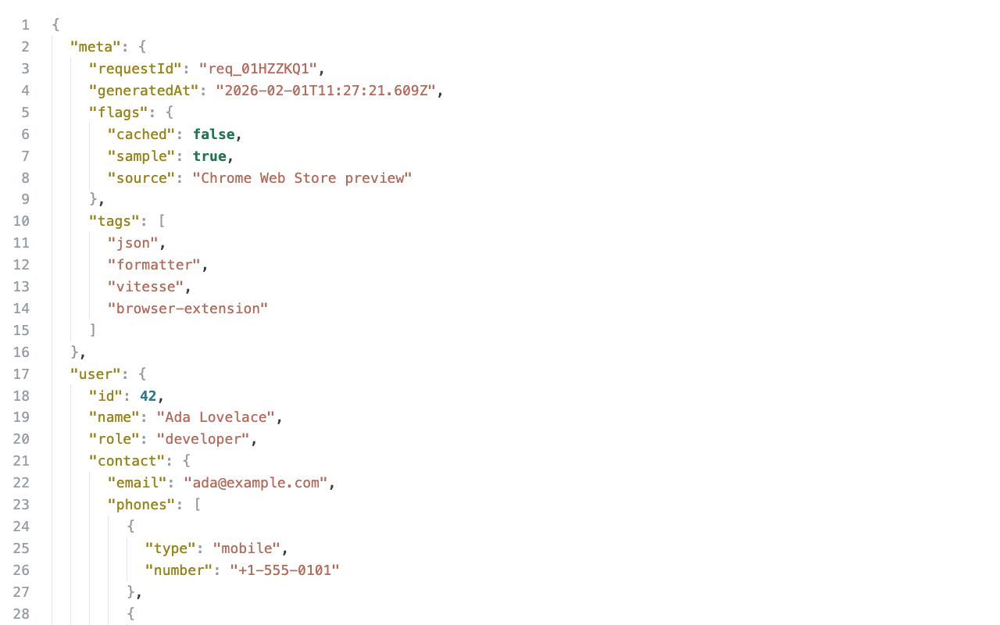

# JSON Formatter Extension

[Report Bug](https://github.com/luckfunc/json-formatter-extension/issues) · [Request Feature](https://github.com/luckfunc/json-formatter-extension/issues/new) · English · [中文](README.zh-CN.md)



A browser JSON formatter extension.

## Chrome Web Store

https://chromewebstore.google.com/detail/json-formatter/ofadnldamdmdmcldhoeadgehhfjgdbla

## Features

- Structured JSON view (collapsible)
- Theme switching (Options / Popup)
- Raw mode uses the browser's default rendering
- Multiple themes (Classic / VSCode / GitHub / Claude / Google / Ayu (Zed) / Vitesse)

## Development

```bash
pnpm install
pnpm run build
```

Build output is in `dist/`. Load it in Chrome via "Load unpacked".

## Thanks

This project borrows interaction ideas from Monaco Editor. Thanks for the open-source work:
https://github.com/microsoft/monaco-editor

Theme colors are based on:
- https://github.com/k4yt3x/zed-theme-ayu-darker
- https://github.com/antfu/vscode-theme-vitesse
