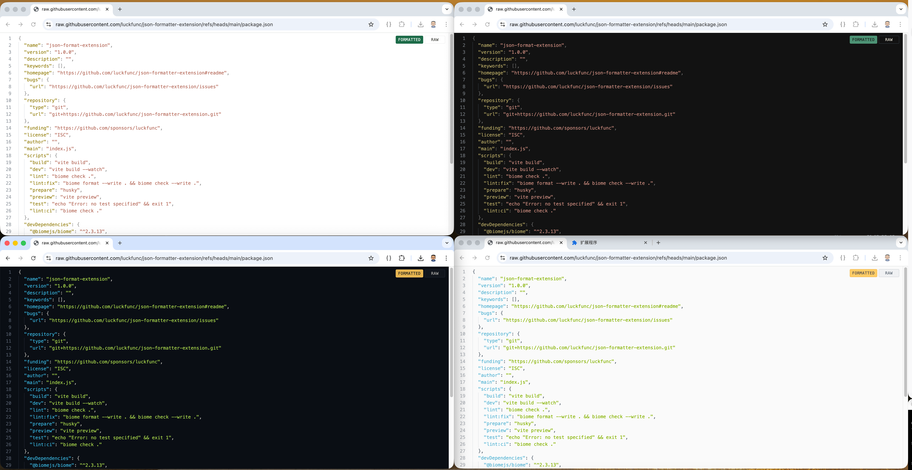

# JSON Formatter Extension

[Report Bug](https://github.com/luckfunc/json-formatter-extension/issues) · [Request Feature](https://github.com/luckfunc/json-formatter-extension/issues/new) · [English](README.md) · 中文



一个用于浏览器的 JSON 格式化插件

## 功能

- JSON 结构化展示（可折叠）
- 主题切换（Options / Popup）
- 原始 Raw 模式：回到浏览器默认展示
- 支持多套主题（Classic / VSCode / GitHub / Claude / Google / Ayu（Zed） / Vitesse）

## 开发

```bash
pnpm install
pnpm run build
```

构建产物在 `dist/`，Chrome 里用“加载已解压的扩展程序”即可。

## 致谢

本项目在设计与交互上借鉴了 Monaco Editor 的一些思路，感谢其开源实现：
https://github.com/microsoft/monaco-editor

主题配色参考：
- https://github.com/k4yt3x/zed-theme-ayu-darker
- https://github.com/antfu/vscode-theme-vitesse
